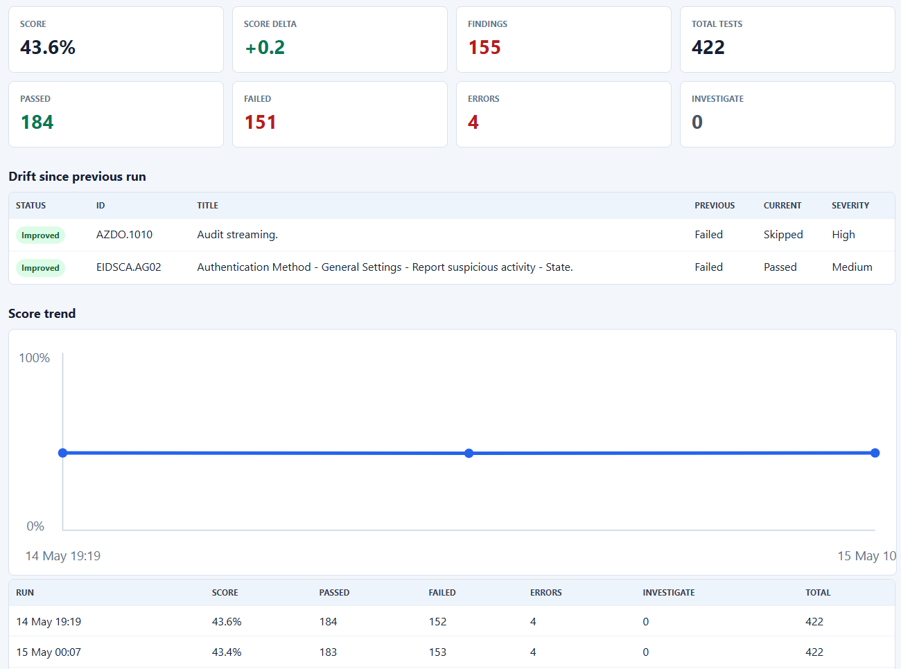
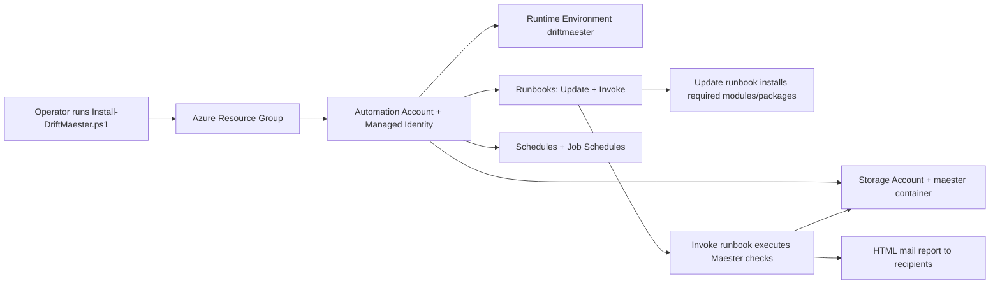
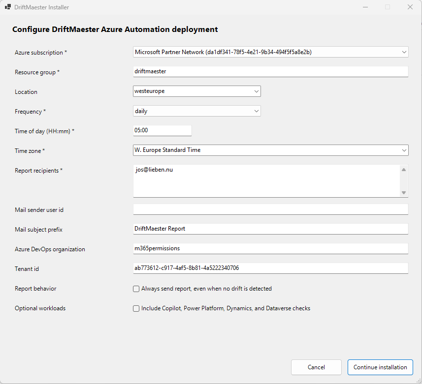
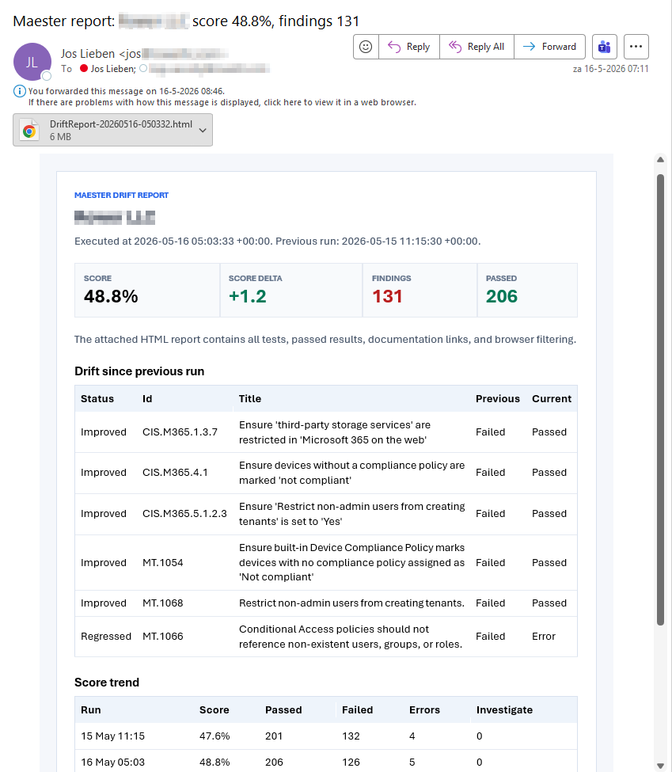

# DriftMaester

DriftMaester is a plug-and-play Azure Automation implementation of Maester with drift detection, trend tracking, and email reporting.

It helps the (slightly?) less tech savvy or time-constrained IT admins to not only run Maester, but to run it regularly and get alerted when their compliance drifts.



## Quick install:

```powershell
iex ((Invoke-WebRequest -UseBasicParsing 'https://raw.githubusercontent.com/jflieben/DriftMaester/main/Install-DriftMaester.ps1').Content)
```

## What DriftMaester does

- Automatically deploys an Azure Automation setup (resource group, automation account, runtime, runbooks, storage).
- Sets correct authorizations in Graph, Azure and Exchange
- Runs Maester checks on a schedule (daily, weekly, or monthly).
- Stores result history in secure Azure Blob Storage.
- Detects configuration drift and highlights regressions each run
- Sends HTML reports by email.
- Keeps its runtime modules and package set updated using the update runbook, so each run has the latest tests / Maester version.

## Alternatives

DriftMaester runs in your tenant, if you want an even more hands-off option, consider the [hosted](https://maester.cloud/) option by Maester's original author, [Merill](https://www.linkedin.com/in/merill/).

## Repository structure

- `Install-DriftMaester.ps1`: interactive installer and updater for Azure resources and permissions.
- `Runbooks/Invoke-DriftMaester.ps1`: main runbook that executes Maester, compares results, and mails reports.
- `Runbooks/Update-DriftMaester.ps1`: runtime/package maintenance runbook.
- `Runbooks/Remove-DriftMaester.ps1`: uninstall runbook.

## High-level architecture and flow



## Requirements

### Local requirements (for running installer)

- PowerShell 7+
- Az PowerShell modules installed locally:
	- `Az.Accounts`
	- `Az.Resources`
	- `Az.Automation`
	- `Az.Storage`
- Microsoft Graph PowerShell module:
	- `Microsoft.Graph.Authentication`
- Exchange Online module:
	- `ExchangeOnlineManagement`

Local requirements are automatically handled by the installer. If a required module is missing, `Install-DriftMaester.ps1` installs it automatically.

### Azure and Entra permissions

You should run install with a Global Administator OR an account that can:

- Create/update resource groups and Azure Automation resources.
- Assign RBAC roles in the target resource group.
- Assign root-scope Reader roles to the managed identity (`/` and `/providers/Microsoft.aadiam`).
- Grant Microsoft Graph app roles and directory roles to the managed identity.
- Grant the SharePoint Online `Sites.FullControl.All` app role to the managed identity, which the SharePoint Online tests need to read tenant settings.
- Create Exchange Online service principal and management role assignment.

For root-scope assignment, the installer attempts normal assignment first. If denied, it temporarily elevates access using:

- `POST /providers/Microsoft.Authorization/elevateAccess?api-version=2015-07-01`

and automatically removes the temporary elevation assignment afterward.

### Runtime requirements (inside Azure Automation)

The runtime environment is configured with default packages and then maintained by the update runbook.

### Optional workload prerequisites

Some checks need additional access outside the Azure resources and Entra permissions configured by the installer. Configure these before enabling the related scans if you wish to include them

**Copilot Studio, Power Platform, Dynamics, and Dataverse**

Dataverse access is required for the Copilot Studio security tests that evaluate Copilot Studio agent configurations.

Create an application user in Power Platform:

1. Go to the Power Platform Admin Center.
2. Select the environment you want DriftMaester to evaluate.
3. Go to **Settings** > **Users + permissions** > **Application users**.
4. Click **New app user** > **Add an app**.
5. Search for `driftmaester` and select it.
6. Select the correct business unit.
7. Assign a security role with read access:
	- `Basic User` for simplicity, or
	- A custom role, for example `Maester Security Reader`, with organization-level read access on `Agent (bot)`, `Agent component (botcomponent)`, `User (systemuser)`, and `Connection Reference (connectionreference)`.
8. Click **Create**.

After this is configured, enable the workload in the installer with `-IncludeCopilotAndDataverse $true`, or tick the matching checkbox in the GUI. If you've already installed you can rerun the installer or you can modify the scheduled job in Azure directly.

**Azure DevOps**

For Azure DevOps scans, the DriftMaester managed identity must be added to the Azure DevOps organization at `https://dev.azure.com/ORGNAMEHERE/_settings/users` and granted access to every project that should be scanned.

For maximum test coverage, also add the DriftMaester managed identity to **Security** > **Permissions** > **Project Collection Administrators**.

## Installation

### Direct from GitHub

Copy/paste ready command to run directly from GitHub:

```powershell
iex ((Invoke-WebRequest -UseBasicParsing 'https://raw.githubusercontent.com/jflieben/DriftMaester/main/Install-DriftMaester.ps1').Content)
```

3. Follow prompts in order:
	 - Select Azure subscription.
	 - Enter resource group name.
	 - Enter deployment location (press Enter for `westeurope`).
	 - Choose run frequency, run time, and time zone.
	 - Enter report recipients and optional sender/org/tenant/subject/report behavior/workload settings.
4. Approve sign-in prompts for Azure, Graph, and Exchange Online when requested.


### Manual, GUI mode (Windows, recommended)

Runs automatically if any required parameter is missing:

```powershell
.\Install-DriftMaester.ps1
```

The native PowerShell form opens on Windows:
- Select your Azure subscription
- Enter resource group name, location
- Choose run frequency (daily, weekly, monthly), time, and time zone
- Enter email recipients and optional settings
- Choose whether reports are sent only when drift is detected, or after every run
- Choose whether Copilot, Power Platform, Dynamics, and Dataverse checks are included

Installer preview:



On non-Windows platforms, provide all required parameters or use the console prompts.

### CLI/Headless Mode (Scripting & Automation)

For scripting or when you have all parameters ready, supply them all:

```powershell
.\Install-DriftMaester.ps1 -Subscription "sub-id" -ResourceGroup "rg-drift" `
	-Recipients "admin@company.com" -Frequency "daily" -TimeOfDay "02:00" -TimeZone "W. Europe Standard Time" `
	-AlwaysSendReport $true -IncludeCopilotAndDataverse $true
```

The installer runs mostly silently except for logins to Graph and Exchange if you're not already logged in.

`-AlwaysSendReport $true` passes `AlwaysSendReport` to the scheduled `Invoke-DriftMaester` runbook. By default this is `$false`, which means DriftMaester sends mail on the first run and when drift is detected. Set it to `$true` when you want a report after every scheduled run, even if nothing changed.

`-TimeZone "W. Europe Standard Time"` sets the time zone used by the Azure Automation schedules. If omitted, the installer uses the local system time zone. Use the time zone id expected by Azure Automation, for example `W. Europe Standard Time`.

`-IncludeCopilotAndDataverse $true` passes `includeCopilotAndDataverse` to the scheduled `Invoke-DriftMaester` runbook. By default this is `$false`, which skips Copilot Studio, Power Platform, Dynamics, and Dataverse-backed Maester checks and suppresses Dataverse connection warnings. Set it to `$true` when the managed identity has access to the Dataverse environment and you want those checks included.

**Mixed Mode** (Partial Parameters)

Provide some parameters and use GUI for the rest:

```powershell
.\Install-DriftMaester.ps1 -Subscription "sub-id" -Recipients "admin@company.com"
```

The GUI launches with those fields pre-populated.

### What the installer creates/configures

- Resource group (if missing)
- Automation account with system-assigned managed identity
- Storage account and `maester` blob container
- Runtime environment `driftmaester`
- Runbooks `Invoke-DriftMaester` and `Update-DriftMaester`
- Schedules and job schedules
- Azure RBAC role assignments for managed identity
- Root-scope Reader role assignments for managed identity
- Graph API app-role assignments and directory roles
- Exchange Online service principal + `View-Only Configuration` assignment

### Permission matrix (high-level)

| Area | Granted by installer | Why |
|---|---|---|
| Azure RBAC (resource group) | Reader | Read tenant resources referenced by checks |
| Azure RBAC (storage account) | Storage Blob Data Contributor | Store reports/history and cached test content |
| Azure RBAC (automation account) | Automation Contributor | Manage runbook jobs and schedules |
| Azure RBAC (root scopes) | Reader on `/` and `/providers/Microsoft.aadiam` | Tenant-wide Azure visibility needed by some checks |
| Microsoft Graph app roles | Listed in `RequiredGraphApplicationPermissions` in installer | Required by Maester Graph workloads |
| Exchange app role | `Exchange.ManageAsApp` | Exchange Online and compliance checks |
| Directory roles | Global Reader, Teams Reader, Azure DevOps Administrator (optional) | Workload coverage for corresponding tests |

At install completion, DriftMaester prints an access report with the effective grant set.

### Cost estimate

- Azure Automation: Basic tier run time cost applies. If jobs run long and often, monthly cost can exceed free minutes.
- Azure Storage: Blob storage and transaction costs for result history, reports, and optional cache/config artifacts.

This follows official documentation at [Maester](https://maester.dev/docs/connect-maester/connect-maester-advanced/)

## Usage

### Normal operations

- DriftMaester runs automatically on its configured schedule.
- Update runbook runs one hour before invoke runbook.
- Invoke runbook stores results and sends report emails.

Report preview:

Email summary received after a run:



### Manual run

You can start either runbook manually from Azure Automation:

- `Update-DriftMaester` first (optional but recommended)
- `Invoke-DriftMaester`

### Re-running installation

Re-running `Install-DriftMaester.ps1` is supported and intended.

Idempotent behavior includes:

- Reuse existing resources where possible.
- Reapply runbook content from this repository.
- Recreate deterministic schedules/job schedules.
- Skip role assignments and permissions already present.

## Uninstall

Use the uninstaller for controlled cleanup:

```powershell
.\Remove-DriftMaester.ps1 -Subscription "sub-id-or-name" -ResourceGroup "rg-name"
```

Notes:
- If the resource group is tagged as DriftMaester-managed, full group deletion is offered by default.
- In shared resource groups, scoped cleanup is performed (runbooks/schedules/permissions; optional data removal).
- Use `-KeepData` to preserve storage and historical artifacts.

## Troubleshooting

### Runtime shows packages as Not Configured

- Re-run installer to reset everything
- Run `Update-DriftMaester` manually and check runbook output.

### Root RBAC assignment fails

- Ensure account is Global Administrator and elevation is allowed.

### Graph/Exchange permission or auth failures

- Use an account with enough admin rights for consent, app role assignment, and EXO RBAC.
- Verify tenant context in prompts before confirming.
- Run the installer in a **fresh PowerShell session**. PnP.PowerShell, MicrosoftTeams and ExchangeOnlineManagement each ship their own `Microsoft.Identity.Client` (MSAL), and .NET keeps only the first version loaded in a session. If one of those loaded an older MSAL first, `Connect-MgGraph` fails with a type load error such as `Could not load type 'Microsoft.Identity.Client.IMsalSFHttpClientFactory'` and no sign-in browser appears. The installer detects this and tells you which module caused it.

### First run / RunNow behavior

- `-RunNow` waits for the update runbook to finish and then starts the invoke runbook.
- If update fails, invoke is not started.

### Report delivery and size behavior

- `ReportDelivery` supports `auto`, `attach`, and `link` modes.
- If attachment payload approaches Graph `sendMail` request limits, oversized attachments are skipped and warnings are logged.

### Failure alerting

- Invoke runbook sends a failure notification email when execution fails.

## Security notes

- Managed identity is used for runbook runtime auth.
- Results are stored in your own Azure Storage account.
- Email is sent through Graph API using configured sender behavior.
- Review role assignments and granted app permissions before production use.

## Licensing and links

Free for non-commercial use.

Although I've contributed to the open source Maester project, I am not directly affiliated with it and this tool only serves as a wrapper / feature add to make your life easier :)

Commercial use requires a license: https://www.lieben.nu/liebensraum/commercial-use/

- Site: https://www.lieben.nu
- Blog: https://www.lieben.nu/liebensraum/
- Author: Jos Lieben (Lieben Consultancy)
